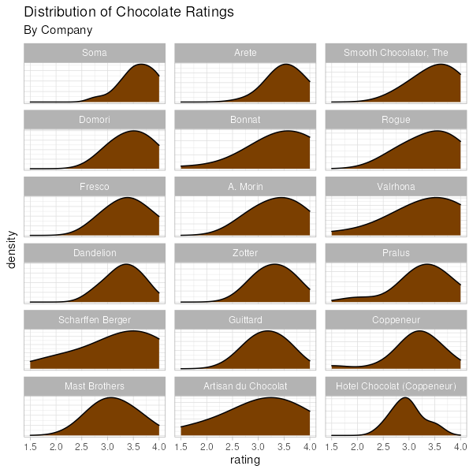
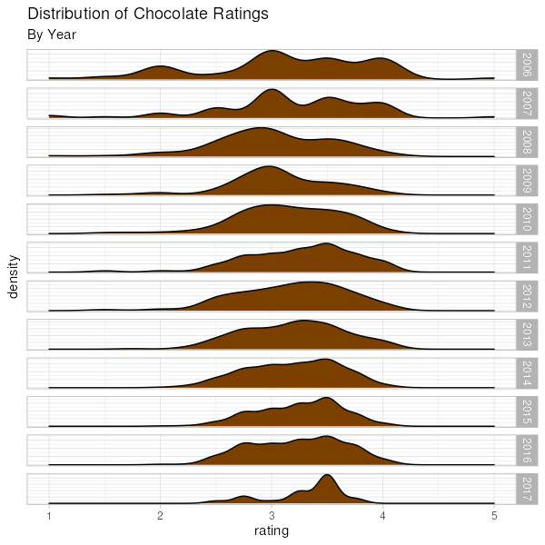
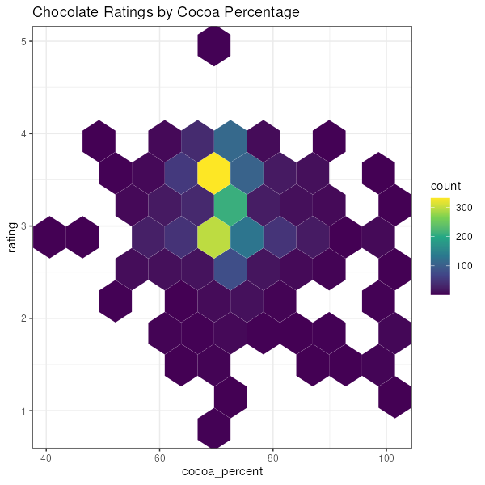

This is a look at what chocolate is rated the highest.

There are a few company's with a good records:

The year doesn't seem to be particularly predictive?

Chocolatiers seem to aim for about 70% Cacoa:

## Data

The data is is from Rachael Tatman at Kaggle.

https://www.kaggle.com/datasets/rtatman/chocolate-bar-ratings

## Running the code

This uses a [taskfile](https://taskfile.dev/) and docker to help manage the environment. This allows one to easily move the code into production on a server or share it with coworkers without having to reconfigure anything. :)
